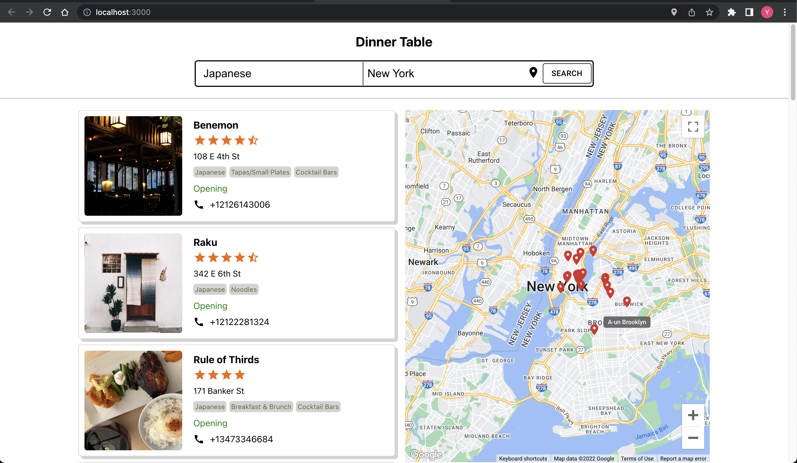

# Dinner Table: A Search Engine for Restaurants

## 1. Preview



## 2. Tech Stack

### Frontend

<ul>
    <li>React.js</li>
    <li>Material UI</li>
</ul>

### Backend
<ul>
    <li>Flask</li>
    <li> 
    <a href="https://docs.developer.yelp.com/docs/fusion-intro">
        Yelp Fusion API</a> 
    </li>
    <li> 
    <a href="https://developers.google.com/maps/apis-by-platform">
        Google Map API</a> 
    </li>
</ul>

## 3. How to run
<ul>

<li>
    Step 0: Prerequisites: Node.js, Flask
</li>

<li>
    Step 1: Clone this repository to your local
</li>
<li>
    Step 2: Start the backend server by running the following command
</li>

```{shell}
flask run
```

<li>
    Step 3: Start the frontend server by running the following command
</li>

```{shell}
npm install
npm start
```

</ul>
